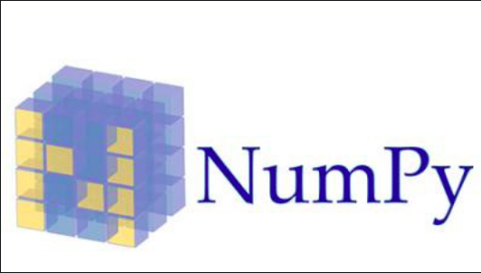
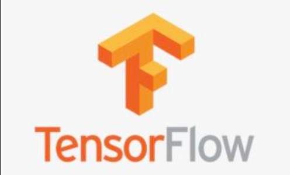
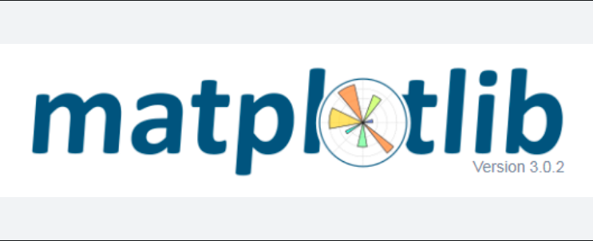

### Best Python Libraries for Machine Learning

In the older days, people used to perform Machine Learning tasks by manually coding all the algorithms and mathematical and statistical formulas. This made the processing time-consuming, tedious, and inefficient. But in the modern days, it is become very much easy and more efficient compared to the olden days with various python libraries, frameworks, and modules. Today, Python is one of the most popular programming languages for this task and it has replaced many languages in the industry, one of the reasons is its vast collection of libraries. Python libraries that are used in Machine Learning are:

- Numpy
- Scipy
- Scikit-learn
- Theano
- TensorFlow
- Keras
- PyTorch
- Pandas
- Matplotlib

**Numpy**


NumPy is a very popular python library for large multi-dimensional array and matrix processing, with the help of a large collection of high-level mathematical functions. It is very useful for fundamental scientific computations in Machine Learning. It is particularly useful for linear algebra, Fourier transform, and random number capabilities. High-end libraries like TensorFlow uses NumPy internally for manipulation of Tensors.

```python
# Python program using NumPy  
# for some basic mathematical  
# operations 
  
import numpy as np 
  
# Creating two arrays of rank 2 
x = np.array([[1, 2], [3, 4]]) 
y = np.array([[5, 6], [7, 8]]) 
  
# Creating two arrays of rank 1 
v = np.array([9, 10]) 
w = np.array([11, 12]) 
  
# Inner product of vectors 
print(np.dot(v, w), "\n") 
  
# Matrix and Vector product 
print(np.dot(x, v), "\n") 
  
# Matrix and matrix product 
print(np.dot(x, y))
```

**SciPy**


SciPy is a very popular library among Machine Learning enthusiasts as it contains different modules for optimization, linear algebra, integration and statistics. There is a difference between the SciPy library and the SciPy stack. The SciPy is one of the core packages that make up the SciPy stack. SciPy is also very useful for image manipulation.

```python
# Python script using Scipy  
# for image manipulation 
  
from scipy.misc import imread, imsave, imresize 
  
# Read a JPEG image into a numpy array 
img = imread('D:/Programs / cat.jpg') # path of the image 
print(img.dtype, img.shape) 
  
# Tinting the image 
img_tint = img * [1, 0.45, 0.3] 
  
# Saving the tinted image 
imsave('D:/Programs / cat_tinted.jpg', img_tint) 
  
# Resizing the tinted image to be 300 x 300 pixels 
img_tint_resize = imresize(img_tint, (300, 300)) 
  
# Saving the resized tinted image 
imsave('D:/Programs / cat_tinted_resized.jpg', img_tint_resize)
```

If `scipy.misc` does not work on your operating system, try using `imageio`:

```python
!pip install imageio
import imageio
from imageio import imread, imsave
```
### Original Image

### Tinted Image

### Resized Tinted Image


**Scikit-learn**


Scikit-learn is one of the most popular ML libraries for classical ML algorithms. It is built on top of two basic Python libraries, viz., NumPy and SciPy. Scikit-learn supports most of the supervised and unsupervised learning algorithms. Scikit-learn can also be used for data-mining and data-analysis, which makes it a great tool for those starting out with ML.

```python
# Python script using Scikit-learn  
# for Decision Tree Classifier 
  
# Sample Decision Tree Classifier 
from sklearn import datasets 
from sklearn import metrics 
from sklearn.tree import DecisionTreeClassifier 
  
# load the iris datasets 
dataset = datasets.load_iris() 
  
# fit a CART model to the data 
model = DecisionTreeClassifier() 
model.fit(dataset.data, dataset.target) 
print(model) 
  
# make predictions 
expected = dataset.target 
predicted = model.predict(dataset.data) 
  
# summarize the fit of the model 
print(metrics.classification_report(expected, predicted)) 
print(metrics.confusion_matrix(expected, predicted))
```

**Theano**


Theano is a popular python library that is used to define, evaluate and optimize mathematical expressions involving multi-dimensional arrays in an efficient manner. It is achieved by optimizing the utilization of CPU and GPU. It is extensively used for unit-testing and self-verification to detect and diagnose different types of errors. Theano is a very powerful library that has been used in large-scale computationally intensive scientific projects for a long time but is simple and approachable enough to be used by individuals for their own projects.

```python
# Python program using Theano 
# for computing a Logistic  
# Function 
  
import theano 
import theano.tensor as T 
x = T.dmatrix('x') 
s = 1 / (1 + T.exp(-x)) 
logistic = theano.function([x], s) 
logistic([[0, 1], [-1, -2]])
```

**TensorFlow**



TensorFlow is a very popular open-source library for high performance numerical computation developed by the Google Brain team in Google. As the name suggests, TensorFlow is a framework that involves defining and running computations involving tensors. It can train and run deep neural networks that can be used to develop several AI applications. TensorFlow is widely used in the field of deep learning research and application.

```python
#  Python program using TensorFlow 
#  for multiplying two arrays 
  
# import `tensorflow`  
import tensorflow as tf 
  
# Initialize two constants 
x1 = tf.constant([1, 2, 3, 4]) 
x2 = tf.constant([5, 6, 7, 8]) 
  
# Multiply 
result = tf.multiply(x1, x2) 
  
# Initialize the Session 
sess = tf.Session() 
  
# Print the result 
print(sess.run(result)) 
  
# Close the session 
sess.close()
```

**Keras**


Keras is a very popular Machine Learning library for Python. It is a high-level neural networks API capable of running on top of TensorFlow, CNTK, or Theano. It can run seamlessly on both CPU and GPU. Keras makes it really for ML beginners to build and design a Neural Network. One of the best things about Keras is that it allows for easy and fast prototyping.

**PyTorch**

PyTorch is a popular open-source Machine Learning library for Python based on Torch, which is an open-source Machine Learning library that is implemented in C with a wrapper in Lua. It has an extensive choice of tools and libraries that support Computer Vision, Natural Language Processing(NLP), and many more ML programs. It allows developers to perform computations on Tensors with GPU acceleration and also helps in creating computational graphs.

```python
# Python program using PyTorch 
# for defining tensors fit a 
# two-layer network to random 
# data and calculating the loss 

import torch 


dtype = torch.float
device = torch.device("cpu") 
# device = torch.device("cuda:0") Uncomment this to run on GPU 

# N is batch size; D_in is input dimension; 
# H is hidden dimension; D_out is output dimension. 
N, D_in, H, D_out = 64, 1000, 100, 10

# Create random input and output data 
x = torch.random(N, D_in, device=device, dtype=dtype) 
y = torch.random(N, D_out, device=device, dtype=dtype) 

# Randomly initialize weights 
w1 = torch.random(D_in, H, device=device, dtype=dtype) 
w2 = torch.random(H, D_out, device=device, dtype=dtype) 

learning_rate = 1e-6
for t in range(500): 
	# Forward pass: compute predicted y 
	h = x.mm(w1) 
	h_relu = h.clamp(min=0) 
	y_pred = h_relu.mm(w2) 

	# Compute and print loss 
	loss = (y_pred - y).pow(2).sum().item() 
	print(t, loss) 

	# Backprop to compute gradients of w1 and w2 with respect to loss 
	grad_y_pred = 2.0 * (y_pred - y) 
	grad_w2 = h_relu.t().mm(grad_y_pred) 
	grad_h_relu = grad_y_pred.mm(w2.t()) 
	grad_h = grad_h_relu.clone() 
	grad_h[h < 0] = 0
	grad_w1 = x.t().mm(grad_h) 

	# Update weights using gradient descent 
	w1 -= learning_rate * grad_w1 
	w2 -= learning_rate * grad_w2 

```

**Pandas**


Pandas is a popular Python library for data analysis. It is not directly related to Machine Learning. As we know that the dataset must be prepared before training. In this case, Pandas comes handy as it was developed specifically for data extraction and preparation. It provides high-level data structures and wide variety tools for data analysis. It provides many inbuilt methods for grouping, combining and filtering data.

```python
# Python program using Pandas for  
# arranging a given set of data  
# into a  table 
  
# importing pandas as pd 
import pandas as pd 
  
data = {"country": ["Brazil", "Russia", "India", "China", "South Africa"], 
       "capital": ["Brasilia", "Moscow", "New Delhi", "Beijing", "Pretoria"], 
       "area": [8.516, 17.10, 3.286, 9.597, 1.221], 
       "population": [200.4, 143.5, 1252, 1357, 52.98] } 
  
data_table = pd.DataFrame(data) 
print(data_table)
```

**Matplotlib**



Matplotlib is a very popular Python library for data visualization. Like Pandas, it is not directly related to Machine Learning. It particularly comes in handy when a programmer wants to visualize the patterns in the data. It is a 2D plotting library used for creating 2D graphs and plots. A module named pyplot makes it easy for programmers for plotting as it provides features to control line styles, font properties, formatting axes, etc. It provides various kinds of graphs and plots for data visualization, viz., histogram, error charts, bar chats, etc.

```python
#  Python program using Matplotlib  
# for forming a linear plot 
  
# importing the necessary packages and modules 
import matplotlib.pyplot as plt 
import numpy as np 
  
# Prepare the data 
x = np.linspace(0, 10, 100) 
  
# Plot the data 
plt.plot(x, x, label ='linear') 
  
# Add a legend 
plt.legend() 
  
# Show the plot 
plt.show()
```
